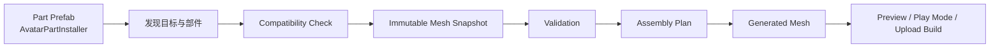

# Avatar Part Assembler

**Avatar Part Assembler（APA）** 是一个面向 **VRChat 模块化 Avatar 部件** 的 Unity / NDMF 插件。

它把部件安装声明、身体区域移除、顶点级接缝焊接、骨骼与蒙皮、BlendShape、UV、材质以及 Modular Avatar 集成收敛到同一条 **可预览、可验证、可回滚** 的构建流水线中。

> **Builder 不猜，Validator 负责阻止错误资产进入构建。**  
> APA 不会为了“看起来能用”而猜测接缝、骨骼、UV 或材质关系；无法安全保留的数据会阻止构建，并给出稳定的 `APAxxx` / `reason=...` 诊断。

**当前版本：`0.5.3` · Unity `2022.3` · English / 简体中文 · MIT**

> [!IMPORTANT]
> APA 目前仍处于 **1.0 前的验收阶段**。核心构建、预览和 Play Mode 路径已经实现，但完整人工验收清单尚未全部完成。用于正式发布前，建议在目标 Avatar 上执行仓库中的验收流程。

---

## APA 解决什么问题

部件作者可以把“替换身体哪一块、接缝如何焊接、骨骼/BlendShape/UV/材质如何合并”等信息制作成可分发的部件 Prefab。Avatar 使用者只需要把 Prefab 放到 Avatar 下方，APA 就会在 **NDMF Scene View Preview、Play Mode / Gesture Manager 和最终上传构建** 中完成装配。

核心能力：

- **非破坏式安装**：不会把装配结果永久写回原 Avatar Mesh。
- **Prefab 即安装单元**：根节点上的 `AvatarPartInstaller` 描述部件安装信息。
- **真实顶点级 Seam Weld**：部件接缝顶点重映射到保留的身体顶点，而不是简单叠放两层顶点。
- **黑白 Removal Mask**：通过目标身体 UV 对应的纹理遮罩生成待移除三角形。
- **显式一对一接缝配对**：作者阶段按世界坐标生成，构建阶段只验证和消费，不重新猜测。
- **UV / Material Semantics**：通过语义合并，不依赖 Unity UV 通道编号或 Material 文件名作为跨部件协议。
- **Bones / Skinning / BlendShape 合并**：保留目标身体骨架权威，并把部件数据重映射到最终 Mesh。
- **事务式多部件装配**：所有目标组先完成验证和规划，再开始写入，避免半安装状态。
- **Preview 与 Build 共用核心逻辑**：Scene View、Play Mode 与 Upload Build 不维护第二套装配器。
- **Modular Avatar 集成**：支持临时 Merge Armature、Merge Animator 重定向和空源对象清理。
- **可选受保护网格模式**：Prefab 可以不直接携带源 Mesh，而使用 APA 自有的加密载荷与完整性校验。
- **双语 UI 与稳定诊断**：界面支持 English / 简体中文；错误 token 保持稳定，便于搜索、测试和反馈。

---

## 工作方式



APA 的四个核心原则：

1. **作者先声明，构建只消费声明。** Profile 保存稳定 Part ID、目标兼容性信息、移除区域、显式 Seam Pair、UV/Material 语义、骨架路径和 BlendShape 策略。
2. **目标身体在焊接点拥有最终权威。** 焊接后保留身体顶点的位置、法线、切线、颜色和 Skinning；UV 根据语义兼容规则处理。
3. **先规划全部目标组，再修改临时对象。** 任意一组出现阻断错误，都不会留下部分生成的 Avatar。
4. **原始资产不被写回。** 删除部件 Prefab，即可恢复原来的作者层级和 Mesh 资产。

---

## 环境要求

| 依赖 | 版本范围 |
| --- | --- |
| Unity | `2022.3` |
| VRChat SDK – Avatars | `>=3.10.4 <3.11.0` |
| NDMF | `>=1.14.0 <2.0.0-a` |
| Modular Avatar | `>=1.18.0-beta.0 <2.0.0-a` |
| `com.unity.modules.animation` | `1.0.0` |

依赖范围以 [`package.json`](package.json) 为准。部件**制作**时，参与读取的 Mesh 需要允许 Unity 读取其网格数据；具体导入要求见[部件制作指南](Documentation~/PART_AUTHORING_GUIDE.zh-CN.md)。

---

## 安装

### 推荐：固定版本 Release

当前 Release：[`v0.5.3`](https://github.com/qq1299235059/avatar-part-assembler/releases/tag/v0.5.3)

Release 自动提供：

- `dev.avatar-part-assembler-0.5.3.unitypackage`
- `dev.avatar-part-assembler-0.5.3.zip`
- `package.json`

对于普通 Avatar 工程，建议优先使用固定版本，而不是长期跟随 `main`。

### Unity Package Manager / Git URL

在 Unity Package Manager 中选择 **+ → Add package from git URL**：

```text
https://github.com/qq1299235059/avatar-part-assembler.git#v0.5.3
```

需要跟踪开发分支时可以使用：

```text
https://github.com/qq1299235059/avatar-part-assembler.git
```

> [!NOTE]
> 使用 Git URL 时，请确保工程中已经安装兼容版本的 VRChat SDK、NDMF 和 Modular Avatar。VPM 依赖范围声明在 `package.json` 的 `vpmDependencies` 中。

---

## Avatar 使用者：安装一个部件

如果你只是使用别人制作好的 APA 部件，通常不需要配置作者参数：

1. 导入部件作者提供的 Prefab / Package。
2. 把部件 Prefab 拖到 **Avatar 根对象下**。
3. 确认 Prefab 根节点上的 `AvatarPartInstaller` 已启用并引用有效 Profile。
4. 在 **NDMF Scene View Preview** 中检查装配结果。
5. 进入 **Play Mode / Gesture Manager** 检查动画、BlendShape 和材质表现。
6. 正常通过 VRChat SDK 上传；最终构建仍走同一套 APA / NDMF 流程。
7. 不再需要该部件时，删除 Prefab 即可。

APA 不会把装配后的 Mesh 永久写回原 Avatar。

---

## 部件作者：创建可安装部件

打开：

```text
Tools > Avatar Part Assembler > Part Authoring
```

推荐工作流：

1. **Selection**：选择 Avatar Root、Target Renderer、Part Root、Part Renderer。
2. **Armatures**：选择 Target Armature 和 Part Armature；`Suggest Armatures` 只负责建议，最终需要作者确认。
3. **Part Identity**：设置稳定 Part ID；发布后不要随意修改。
4. **Capture Signature**：记录目标网格拓扑、BlendShape、骨骼路径和内容指纹。
5. **Removal Mask**：通过目标身体 UV 对应的黑白纹理生成待移除区域。
6. **Seam Pairing**：通过部件顶点色筛选候选顶点，再按世界坐标生成一对一配对。
7. **UV / Material Semantics**：自动推断后逐项确认语义与来源。
8. **Bone / BlendShape Policy**：确认 Merge Armature、同名 Shape 帧结构和 Part-only Shape 策略。
9. **Validate + Dry-Run Assembly**：先修复阻断错误，再确认预计输出。
10. **Save Profile Asset**：当前新建 Profile 使用 **Schema 5**。
11. **Create Part Prefab**：生成普通 Prefab，或选择受保护网格模式。
12. 使用 Preview、Play Mode 和实际 Avatar 完成发布前验收。

完整的建模、导入、遮罩、接缝顶点色、骨骼权重和发布约束请阅读：

**[Avatar Part Assembler 部件制作指南](Documentation~/PART_AUTHORING_GUIDE.zh-CN.md)**

---

## Removal 与 Seam

### Removal Mask

- 默认白色 = 选择，黑色 = 保留。
- 使用**目标身体**的 UV 通道。
- Mask 只是作者输入，**不会写入 Profile**。
- 最终保存的是明确的三角形地址集合。

### Seam Pairing

- 自动生成只用**部件侧顶点色**筛选候选顶点。
- 默认候选色：`#000000`。
- 比较 `Mesh.colors32` 的 RGBA 四通道精确值。
- 目标身体不要求顶点色；目标候选来自空间位置。
- 默认世界坐标容差：`1e-4`。
- 生成结果保存为**显式一对一 Pair**。

构建阶段不会重新执行“最近点猜测”。模型没对齐时，应修正源资产，而不是无限放宽容差。

---

## UV、材质、骨骼与 BlendShape

### UV

Profile 使用语义名描述 UV，而不是直接把 UV0 / UV1 当作跨资产协议。焊接两侧同名语义不兼容时会阻止构建，而不是静默丢数据。

### Materials

材质语义描述 `semantic name → source submesh → conflict policy`。实际构建优先读取当前 Part Renderer 的 `sharedMaterials[source submesh]`；Profile 中的 Material 是缺失槽位时的回退。

### Bones / Skinning

- 目标身体骨骼优先进入最终 Bone Table。
- 对应骨骼使用所选 Armature 下的相对路径确定身份。
- 新的部件骨骼随后加入。
- Bind Pose 来自源 Mesh 的作者静置数据，而不是当前编辑器姿势。

### BlendShape

- 同名 Shape 必须具有兼容的帧数量和帧权重。
- Position / Normal / Tangent Delta 会一起重映射。
- Part-only Shape 可以按 Profile 策略允许，但焊接区域仍必须满足安全约束。

---

## 受保护网格模式

作者在 **Create Part Prefab** 时可以选择保护 Part Mesh。启用后：

- Prefab 中的 Part Renderer 不再直接引用源 Mesh。
- 几何体保存到同目录的 `<PrefabName>_ProtectedMesh.asset`。
- 载荷经过认证加密并绑定稳定 Part ID。
- Preview、作者 Overlay 和 NDMF Build 共用缓存/解码路径，在内存中恢复几何体。
- 解密后的 Mesh 不写回工程，也不会保存进场景。
- Prefab 与 `_ProtectedMesh.asset` **必须一起分发**。

> [!WARNING]
> 该功能用于减少源网格以普通资产形式直接分发，并检测意外损坏或未重新计算认证标签的修改，**不是抗恶意篡改边界，也不是不可提取的 DRM**。用于解码和生成认证标签的派生材料随插件一起发布，因此能够分析插件的接收者也能够重新构造有效载荷。构建发生在编辑器内，内存里的 Mesh 仍可能被观察；材质、贴图、骨骼和动画也仍是普通 Unity 资产引用。

---

## Modular Avatar / Play Mode 兼容

APA 的 NDMF 流程包括：

- 在需要时生成临时 Modular Avatar Merge Armature。
- 在 Modular Avatar 的相关 Transforming 阶段完成后执行网格装配。
- 重定向对应的 Merge Animator 动画路径到最终目标 Renderer。
- 清理装配后为空的部件源对象。
- 在成功的上传/构建结果中移除剩余 `AvatarPartInstaller` 作者组件。
- Scene View Preview 能读取上游 Modular Avatar Preview 对 Mesh、Material 与 BlendShape 的有效修改；无法证明目标 Mesh 派生关系时会阻止猜测。

`AvatarPartInstaller` 是作者/构建组件；APA 不会通过把整个 Part GameObject 标记为 `EditorOnly` 的方式删除部件骨骼或子对象。

---

## 重要边界与已知限制

当前 APA 不会自动“修复”以下问题：

- 目标身体必须是 `SkinnedMeshRenderer`。
- 非三角形子网格拓扑会被拒绝。
- 不做自动重拓扑、不同顶点数的自动桥接或自动 UV Seam 修复。
- 不通过名称猜测 Target Renderer 或 Armature 层级。
- Armature 选择必须由作者确认。
- 一个非 `Custom` Slot 不允许多个部件同时以 Replace 方式竞争；需要组合时应设计为相应的 Augment 流程。
- UV / BlendShape 冲突不会使用优先级强行覆盖本身无法共存的数据。
- Profile 与 Mesh 使用内容指纹；重新导入或修改 Mesh 后可能需要重新捕获兼容信息。
- 旧式、没有显式 Seam Pairing 的 Profile 需要重新生成 Seam。
- 受保护 Prefab 缺少对应 `_ProtectedMesh.asset` 时会阻止构建。
- 完整人工验收仍在进行中；请参考验收清单确认你的目标生态组合。

遇到阻断错误时，优先修复源资产，不要把验证错误当成可以忽略的警告。

---

## 文档导航

| 文档 | 适合谁 | 内容 |
| --- | --- | --- |
| **[README.md](README.md)** | 所有人 | 项目介绍、安装、快速使用与功能边界 |
| **[部件制作指南](Documentation~/PART_AUTHORING_GUIDE.zh-CN.md)** | 部件作者 | DCC / Unity 准备、Profile、Prefab、Protected Mesh、发布验收 |
| **[技术总览](Documentation~/OVERVIEW.md)** | 开发者 / 维护者 | 数据契约、装配策略、NDMF 顺序、诊断注册表与设计原则 |
| **[CHANGELOG.md](CHANGELOG.md)** | 所有人 | 各版本功能与修复 |
| **[USER_ACCEPTANCE_CHECKLIST.md](USER_ACCEPTANCE_CHECKLIST.md)** | 发布 / 测试 | 人工验收项目 |
| **[SECURITY.md](SECURITY.md)** | 所有人 / 维护者 | 隐私边界、Protected Mesh 威胁模型、安全报告与供应链说明 |
| **[Third Party Notices.md](Third%20Party%20Notices.md)** | 开发者 | 第三方 API / 许可说明 |

---

## 仓库结构

```text
Runtime/
  Common/       稳定错误码、数值策略、路径与数据契约
  Components/   AvatarPartInstaller
  Profiles/     ApaPartProfile / Schema 数据
  Protected/    受保护网格运行时资产

Editor/
  Authoring/    Part Authoring 窗口、Profile / Prefab 写入、Overlay
  Input/        Mesh Snapshot、指纹、部件发现与输入捕获
  Validation/   Compatibility / Removal / Seam / Skinning / BlendShape 规则
  Resolution/   UV / Material 语义解析
  Assembly/     Assembly Plan、Seam Weld、Bone Table、Mesh 生成
  Integration/  Modular Avatar 集成
  NDMF/         Build Pass、Play Mode、诊断和临时资产生命周期
  Preview/      NDMF Render Filter、Preview Cache、Live Materials
  Protected/    编解码、缓存、Hydration 与受保护资产写入
  Localization/ English / 简体中文编辑器文本

Tests/Editor/   EditMode 与源码契约测试
Documentation~/ 深入文档
```

核心装配门面是 `Editor/ApaCore.cs`；NDMF Build 和 Preview 最终复用同一套捕获、验证、规划和组装逻辑。

---

## 运行测试

测试程序集默认使用 `UNITY_INCLUDE_TESTS`。如果希望它显示在 Unity Test Runner 中，可在项目 `manifest.json` 的 `testables` 中加入：

```json
{
  "testables": [
    "dev.avatar-part-assembler"
  ]
}
```

完整手工验证项目见 [`USER_ACCEPTANCE_CHECKLIST.md`](USER_ACCEPTANCE_CHECKLIST.md)。

---

## Issue / Bug Report 建议

提交问题时建议同时提供：Unity / VRChat SDK / NDMF / Modular Avatar / APA 版本、完整 `APAxxx` 错误码、`reason=...` token，以及问题发生在 Preview、Play Mode、Gesture Manager 还是 Upload Build。

稳定诊断 token 被设计为可搜索、可测试的错误契约，因此比只提供截图更容易定位问题。

---

## License

MIT License，见 [`LICENSE.md`](LICENSE.md)。